<p align="center">
  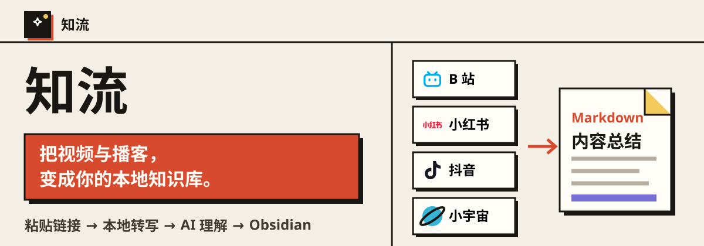
</p>

<p align="center">
  
  
  
  
</p>

**知流**是一款开源的视频与播客知识提炼工具。粘贴链接，先用本地模型把音视频转成可处理的文字，再用你配置的 AI 理解长内容、拆解创作者观点，最终沉淀成适配 Obsidian 的本地 Markdown 知识库。

## 你可以用它做什么

<p align="center">
  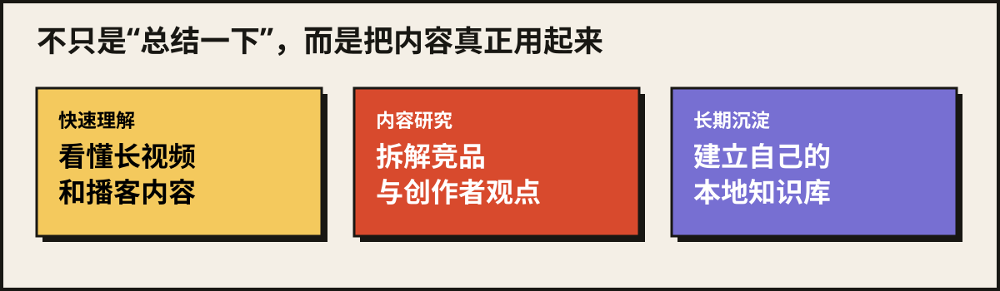
</p>

- **快速理解长内容**：不必完整看完视频或听完播客，先拿到结构、观点和结论。
- **做竞品拆解与内容研究**：分析创作者的选题、内容结构、论据与表达方式，为自己的创作提供研究材料。
- **沉淀个人知识库**：把分散在平台里的内容整理成可搜索、可编辑、可长期保存的本地笔记。

## 从链接到知识稿

<p align="center">
  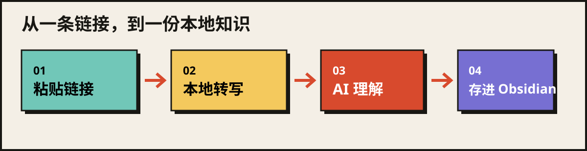
</p>

不用复制内容，也不用手动整理格式。知流在本机完成音视频转写，再把文字交给你选择的 AI 服务生成总结、问答、导图与摘录。

## 本地转写是核心，不是可选装饰

多数视频与播客没有可以直接使用的完整文字。**如果没有本地转写模型，知流就无法稳定完成后续总结与问答。** 首次使用前，建议先运行：

```powershell
.\准备完整本地转写环境.bat
```

脚本会先展示下载计划并等待确认，再根据电脑配置安装依赖，缓存 Whisper、SenseVoiceSmall 与 FSMN-VAD。完整 CPU 环境预计下载约 **3～5 GB**，建议预留 **6～10 GB**；完整 NVIDIA 环境预计下载约 **6～8 GB**，建议预留 **12～15 GB**。

### 不只是“把声音变成字”

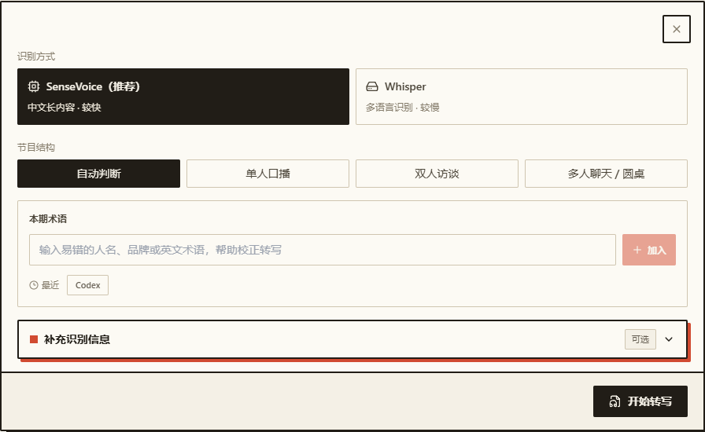

每次只运行你选中的一种识别方式。中文长内容默认推荐 SenseVoice，也可以选择 Whisper；开始前还能指定单人口播、双人访谈或多人聊天，并补充容易识别错误的人名、品牌和英文术语，交给 AI 做后续校对。

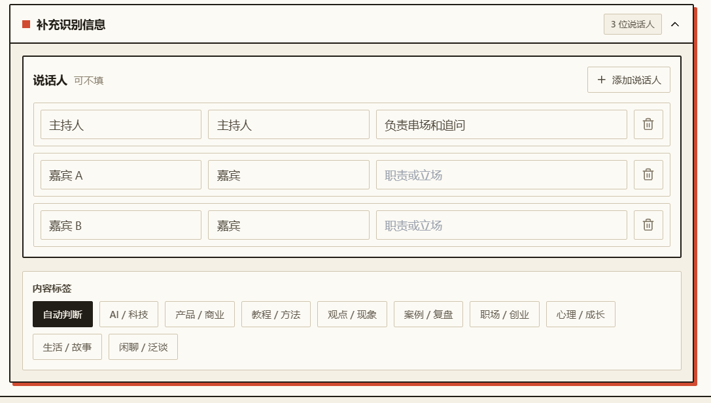

访谈和播客可以继续填写说话人姓名、角色或立场，并选择内容标签。它们不会替你编造内容，只用于帮助转写后的校对、说话人整理和结构化分析。

| 本地模型 | 更适合 | 运行特点 |
|---|---|---|
| **SenseVoiceSmall** | 中文长视频、中文播客、多人对谈 | 默认推荐；本地免费，优先 CUDA，可回退 CPU |
| **Whisper large-v3-turbo** | 英文较多、数字或技术术语密集 | 本地免费，支持 CUDA 和 CPU；通常更慢 |

## Markdown 原生，适配 Obsidian

<p align="center">
  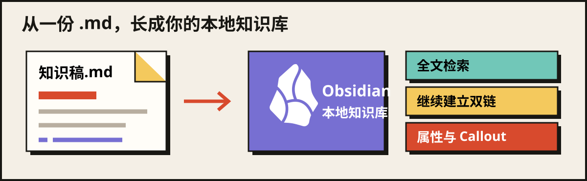
</p>

导出的知识稿是普通 `.md` 文件，可以下载，也可以直接写入你选择的 Obsidian Vault：

- 用 **YAML Properties** 保存平台、作者、来源、关键词和处理日期；
- 用层级标题和原生 **Callout** 保留内容结构与重点摘录；
- 进入 Vault 后即可全文检索，并可继续添加 `[[双链]]`，把一条内容接进自己的知识网络；
- 即使以后不再使用知流或 Obsidian，文件仍能在其他 Markdown 编辑器中继续维护。

> [!NOTE]
> 当前导出不会自动生成双链；知流负责生成结构化 Markdown，双链关系由你在 Obsidian 中继续建立。

## 一份内容，继续整理

<p align="center">
  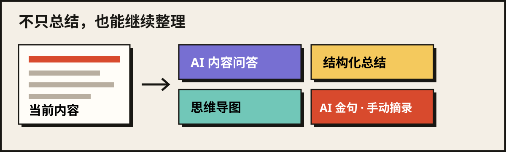
</p>

不只生成一份总结。你可以直接向当前内容提问，追问观点、依据与结论；也可以展开思维导图，或者让 AI 先找出候选金句，再手动摘下真正对你有用的部分。

## 真实产品长什么样

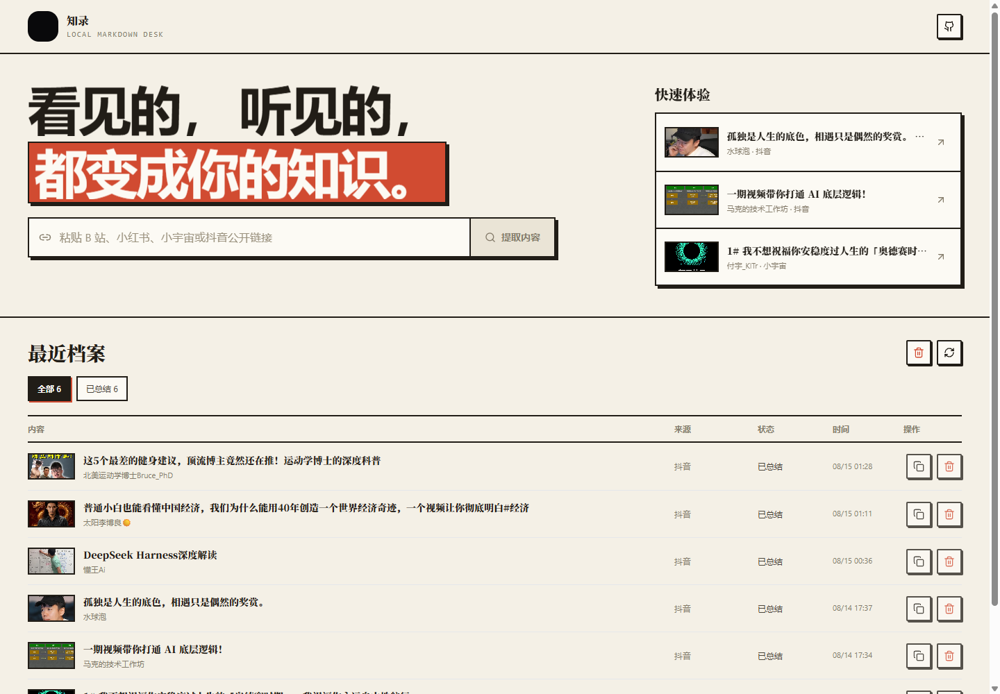

首页只保留一条主路径：粘贴公开链接，或者从快速体验与最近档案进入工作台。解析结果、总结状态和历史记录都保存在本机。

<details>
  <summary><strong>展开查看完整工作台：总结、AI 问答、摘录与思维导图</strong></summary>
  <br>

  ### 结构化总结

  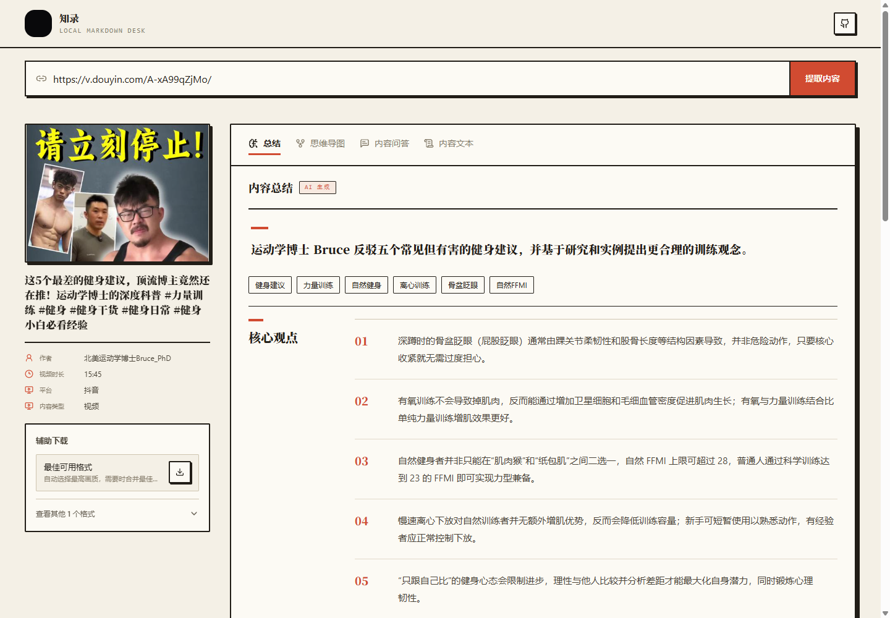

  总结按内容实际结构整理一句话概览、核心观点、内容脉络、方法、依据、案例、争议与边界。

  ### 原文与摘录草稿

  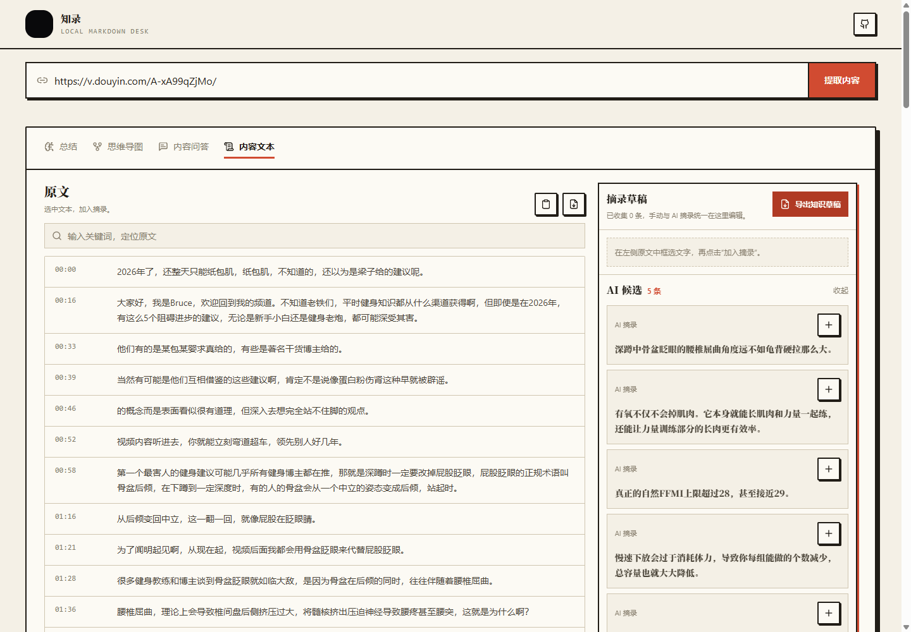

  AI 会先帮你找出候选金句；你也可以边读边把自己的重点手动摘进草稿，最后只保留真正值得带走的内容。

  ### 交互式思维导图

  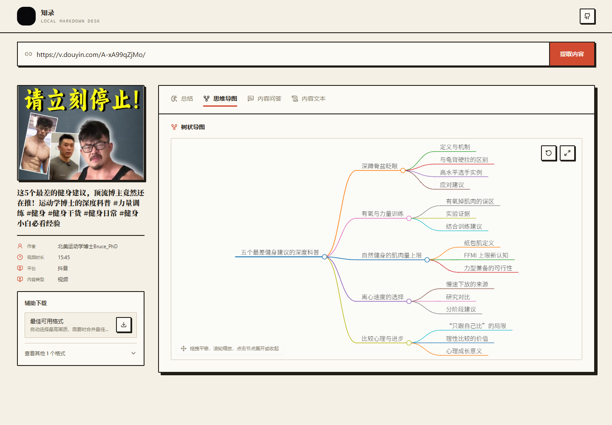

  导图支持缩放、平移、重置、全屏、节点高亮与子树展开收起；不完整文本会明确标注内容边界。
</details>

## 核心能力

| 能力 | 当前实现 |
|---|---|
| 多平台链接解析 | B 站、小红书、抖音、小宇宙，以及其他 yt-dlp 可识别来源的实验支持 |
| 内容整理 | 从链接生成结构化总结，并保留来源信息 |
| 本地模型转写 | SenseVoiceSmall 默认推荐，也可选择 Whisper large-v3-turbo |
| AI 校对术语库 | 转写前选择人名、品牌、缩写和专业术语；只影响 AI 校对，不污染原始识别稿 |
| 结构化工作台 | 总结、交互导图、基于当前内容的问答、时间轴原文与摘录草稿 |
| 本地知识归档 | SQLite 本地历史、普通 Markdown 下载、Obsidian Vault 写入 |
| 辅助媒体保存 | 展示平台当前可用格式；部分格式可由 ffmpeg 合并音视频 |

## 三步启动

**1. 准备环境**：Windows 10 / 11、Python 3.10+、Node.js 20+ 和 Git。

**2. 获取代码并启动**：

```powershell
git clone https://github.com/renhao-wan/zhiflow.git
cd zhiflow
.\启动网站.bat
```

也可以下载源码 ZIP，解压后双击 `启动网站.bat`。

**3. 配置 AI**：首次双击 `启动网站.bat` 且本机还没有 `backend/.env` 时，会自动弹出一个 Windows 配置窗口；它不是网页弹窗。

> [!IMPORTANT]
> **真实的 AI 总结、内容问答与 AI 校对需要你自己的 API Key。** 在首次弹出的本机窗口里选择服务商并填写 Key；保存后自动写入 `backend/.env`，不会进入网页前端，也不会提交到 Git。

<p align="center">
  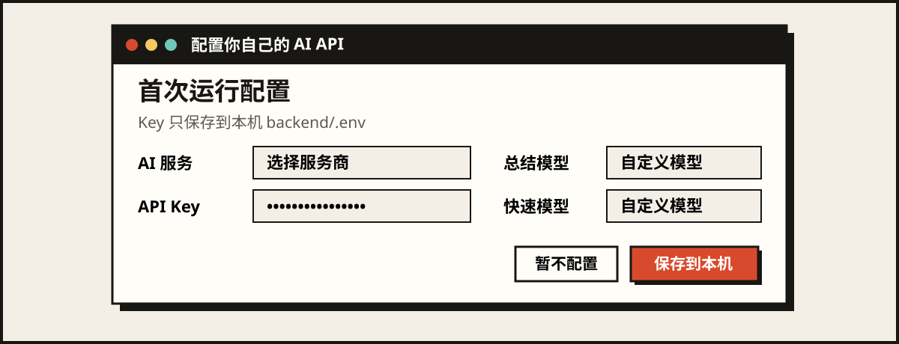
</p>

如果暂时跳过，链接解析、本地历史、本地语音识别和 Markdown 导出仍可使用，但 AI 总结与问答只能得到本地降级结果。首次启动后，这个窗口不会反复自动出现；需要修改时双击 `配置 AI.bat` 重新打开。

配置完成后，启动器会创建项目虚拟环境、安装前后端依赖，并打开 `http://localhost:3000`。

> [!NOTE]
> 这不是只运行 `npm install` 的纯前端项目。根目录启动器会同时管理 FastAPI 后端和 Next.js 前端；纯静态托管无法运行本地 ASR、历史库或 Obsidian 写入。

完整的安装、手动启动与 GPU 可选加速步骤见 [安装指南](./docs/installation.md)。

## 支持范围

| 来源 | 当前支持 | 边界 |
|---|---|---|
| B 站公开视频 | 内容整理、格式列表、辅助下载 | 清晰度取决于平台公开结果与账号权限 |
| 小红书公开视频 | 元数据、作者、格式列表、AI 转写 | 当前只承诺公开的视频笔记页面 |
| 抖音公开视频 | 元数据、实验解析、AI 转写、辅助下载 | 平台页面变化可能影响解析稳定性 |
| 小宇宙公开单集 | 内容整理、本地语音识别 | 当前只承诺公开单集链接 |
| 其他 yt-dlp 来源 | 实验支持 | 不承诺所有站点长期可用 |

当前不包含整档批量导入、浏览器插件、跨媒体全文检索、向量 RAG、付费或受限内容处理。

> [!IMPORTANT]
> 知流只处理你有权访问和分析的公开内容，不支持 DRM、付费、私密或受限媒体，也不提供绕过平台限制的能力。

- 查看 [公开合成知识稿](./docs/examples/knowledge-draft.md)
- 查看 [配置指南](./docs/configuration.md)
- 查看 [Obsidian 导出说明](./docs/obsidian-export.md)
- 查看 [常见问题排查](./docs/troubleshooting.md)

发布前可运行本地敏感信息检查：

```powershell
powershell.exe -NoProfile -ExecutionPolicy Bypass -File .\scripts\check-public-release.ps1
```

## 开发

```powershell
# 后端
cd backend
python -m venv .venv
.\.venv\Scripts\python.exe -m pip install -r requirements.txt
.\.venv\Scripts\python.exe -m uvicorn app.main:app --reload --host 127.0.0.1 --port 8000

# 前端（另开终端）
cd frontend
npm ci
npm run dev
```

最相关的本地检查：

```powershell
backend\.venv\Scripts\python.exe -m unittest discover -s backend\tests -v
cd frontend
npm run test:helpers
npm run build
```

项目入口见 [代码地图](./docs/code-map.md)，贡献方式见 [CONTRIBUTING.md](./CONTRIBUTING.md)。

---

<p align="center">
  <a href="./LICENSE">MIT License</a> ·
  <a href="./CREDITS.md">致谢与来源</a> ·
  <a href="./SECURITY.md">安全说明</a> ·
  <a href="./CONTRIBUTING.md">参与贡献</a>
</p>
